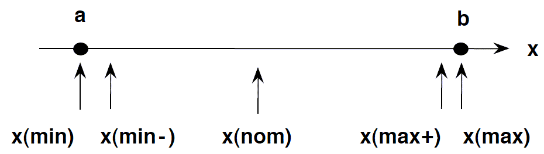

**<h2 style="text-align:center"> Testing Techniques </h2>**

### Why developers needs to do **testing**?

Humans are prone to mistakes, we all make mistakes. Mistakes can be expensive sometimes. Most importantly, bugs/defects can cause a very bad user experience, which can lead to losing a client.   

Whatever we develop needs to be checked/**tested** before we deliver to the client. Ensuring the application/code is usable before delivering to client is crucial in customer satisfaction. In fact a developer's efficiency in a year/over a period of time can be validated by looking into no of bugs and user stories  developed/worked during that period.

Being an analytics team, there is limited scope for testing as long as we are working on generating markdown files and sharing results in the form of excels. As long as we are writing code there will be a way to test the code. Writing unit test cases can increase the efficiency, saves time and effort.

Lets discuss about some basic testing techniques, that can help us test our code deployments quickly.

### 1) Orthogonal array Testing
* Orthogonal array testing is a black box testing technique that is a systematic, statistical way of software testing.    
* It is used when the number of inputs to the system is relatively small, but too large to allow for exhaustive testing of every possible input to the systems

Example :

<center>

Possible Values for each field

<table class="wikitable">

<tbody><tr>
<th>Parameter name</th>
<th>Value 1</th>
<th>Value 2</th>
<th>Value 3</th>
<th>Value 4
</th></tr>
<tr>
<td>Enabled</td>
<td>True</td>
<td>False</td>
<td>-</td>
<td>-
</td></tr>
<tr>
<td>Choice type</td>
<td>1</td>
<td>2</td>
<td>3</td>
<td>-
</td></tr>
<tr>
<td>Category</td>
<td>a</td>
<td>b</td>
<td>c</td>
<td>d
</td></tr></tbody></table>

Total Possible combinations for testing

<table class="wikitable">
<thead><tr>
<th >Enabled</th>
<th >Choice type</th>
<th >Category
</th></tr></thead><tbody>
<tr>
<td>True</td>
<td>3</td>
<td>a
</td></tr>
<tr>
<td>True</td>
<td>1</td>
<td>d
</td></tr>
<tr>
<td>False</td>
<td>1</td>
<td>c
</td></tr>
<tr>
<td>False</td>
<td>2</td>
<td>d
</td></tr>
<tr>
<td>True</td>
<td>2</td>
<td>c
</td></tr>
<tr>
<td>False</td>
<td>2</td>
<td>a
</td></tr>
<tr>
<td>False</td>
<td>1</td>
<td>a
</td></tr>
<tr>
<td>False</td>
<td>3</td>
<td>b
</td></tr>
<tr>
<td>True</td>
<td>2</td>
<td>b
</td></tr>
<tr>
<td>True</td>
<td>3</td>
<td>d
</td></tr>
<tr>
<td>False</td>
<td>3</td>
<td>c
</td></tr>
<tr>
<td>True</td>
<td>1</td>
<td>b
</td></tr></tbody><tfoot></tfoot></table>
</center>

```
If we have 3 parameters, each can have 3 values then the possible Number of tests using conventional method is 3^3 = 27. While the same using OAT, it boils down to 9 test cases.
```

**Source :**  
**https://en.wikipedia.org/wiki/Orthogonal_array_testing**   
**https://en.wikipedia.org/wiki/All-pairs_testing**  
**https://azevedorafaela.com/tag/orthogonal-array-test-examples/**

### 2) Boundary Value Testing
Boundary value testing is the process of testing between extreme ends or boundaries between partitions of the input values.  
* So these extreme ends like Start- End, Lower- Upper, Maximum-Minimum, Just Inside-Just Outside values are called boundary values and the testing is called “boundary testing”.

<p align="center">
  
</p>

* The basic idea in normal boundary value testing is to select input variable values at their:  
        1) Minimum   
        2) Just above the minimum   
        3) A nominal value   
        4) Just below the maximum   
        5) Maximum  

### 2.1) Equivalence Partitioning
In this technique, input data units are divided into equivalent partitions that can be used to derive test cases which reduces time required for testing because of small number of test cases.    

Example 1: Equivalence and Boundary Value
Let’s consider the behavior of Order Pizza Text Box Below
Pizza values 1 to 10 is considered valid. A success message is shown.
While value 11 to 99 are considered invalid for order and an error message will appear, “Only 10 Pizza can be ordered”

Here is the test condition
1) Any Number greater than 10 entered in the Order Pizza field(let say 11) is considered invalid.       
2) Any Number less than 1 that is 0 or below, then it is considered invalid.        
3) Numbers 1 to 10 are considered valid         
4) Any 3 Digit Number say -100 is invalid.          

**Source : https://www.guru99.com/equivalence-partitioning-boundary-value-analysis.html**
### 3) Integration Testing
Integration testing -- also known as integration and testing (I&T) -- is a type of software testing in which the different units, modules or components of a software application are tested as a combined entity.

Example : 
1) Integration between DB and Application.    
> Should test scearios, of how data is saving  
2) Accessing data from API and displaying them in application

### 4) Unit testing

* Unit test basically is small functions that test and help to write robust code. 
* Robust code means a code    
                        1) which will not break easily upon changes,  
                        2) can be refactored simply,    
                        3) can be extended without breaking the rest, and    
                        4) can be tested with ease.    

<center>
<table><tbody><tr><td><h2 style="text-align:center">Argument</h2></td><td><h2 style="text-align:center">Expectations</h2></td></tr><tr><td>expect_lt(), expect_lte(), expect_gt(), expect_gte()</td><td>Is returned value less or greater than specified value?</td></tr><tr><td>expect_equal(), expect_identical()</td><td>Is an object equal to a reference value?</td></tr><tr><td><p>expect_error(), expect_warning(), expect_message(),&nbsp;<p>expect_condition()</p></td><td>Does code throw an error, warning, message, or other condition?</td></tr><tr><td>expect_invisible(), expect_visible()</td><td>Does expression return visibly or invisibly?</td></tr><tr><td><p>skip(), skip_if_not(), skip_if(), skip_if_not_installed(), skip_if_offline(), skip_on_cran(), skip_on_os(), skip_on_travis(), skip_on_appveyor(),&nbsp;</p><p>skip_on_ci(), skip_on_covr(), skip_on_bioc(), skip_if_translated()</p></td><td>Skip a test.</td></tr><tr><td>expect_length()</td><td>Does a vector have the specified length?</td></tr><tr><td>expect_match()</td><td>Does string match a regular expression?</td></tr><tr><td>expect_named()</td><td>Does object have names?</td></tr><tr><td>expect_setequal(), expect_mapequal()</td><td>Do two vectors contain the same values?</td></tr><tr><td>expect_output()</td><td>Does code print output to the console?</td></tr><tr><td>expect_reference()</td><td>Do two names point to the same underlying object?</td></tr><tr><td><p>expect_snapshot_output(), expect_snapshot_value(),</p><p>expect_snapshot_error(), expect_snapshot_condition()</p></td><td>Snapshot testing.</td></tr><tr><td>expect_vector()</td><td>Does the object have vector properties?</td></tr><tr><td>expect_silent()</td><td>Is the code silent?</td></tr><tr><td>expect_type(), expect_s3_class(), expect_s4_class()</td><td>Does the object inherit from a S3 or S4 class, or is it a base type?</td></tr><tr><td>expect_true(), expect_false()</td><td>Is the object true/false?</td></tr><tr><td>verify_output()</td><td>Verify output</td></tr></tbody></table>     
</center>

**Source : https://www.geeksforgeeks.org/unit-testing-in-r-programming//**

*Writing Tests vs. Writing Code*:    
While all these tests are essential, finding a balance that works for you is important. Otherwise, you’ll spend too much time writing tests instead of code.    
**Source : https://www.makeuseof.com/testing-methods-developers-should-know/**